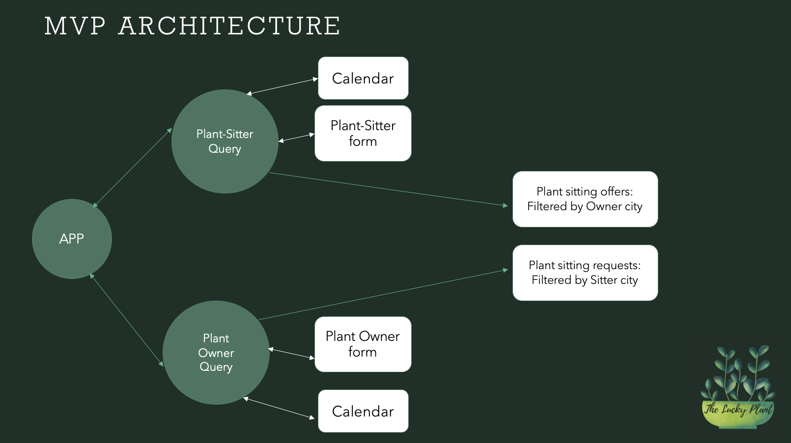

# Getting Started with Create React App

This project was bootstrapped with [Create React App](https://github.com/facebook/create-react-app).

## Available Scripts

In the project directory, you can run:

### `yarn start`

Runs the app in the development mode.\
Open [http://localhost:3000](http://localhost:3000) to view it in the browser.

The page will reload if you make edits.\
You will also see any lint errors in the console.

### `yarn test`

Launches the test runner in the interactive watch mode.\
See the section about [running tests](https://facebook.github.io/create-react-app/docs/running-tests) for more information.

#### Structure of the App

App
    Components: 
        Plant Owner View
            Plant Owner Form
            Calendar
        Plant Sitter View
            Plant Sitter Form
            Calendar
        Matching Requests 

##### Description

There is nothing worse than coming back from holidays and find your beloved plants dead.  
After discussing with friends having plants and struggling when away.
Because it is nicer to set off with peace of mind! 

On the other hand, 
If you have room at home and would like to give some care to a few extra plants for some extra income. The Lucky Plant can help you find opportunities! 
###### Architecture

        _This is a student project that was created at[CodeOp](http://codeop.tech), a full stack development bootcamp in Barcelona._